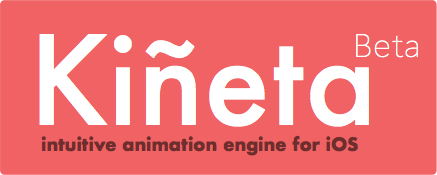
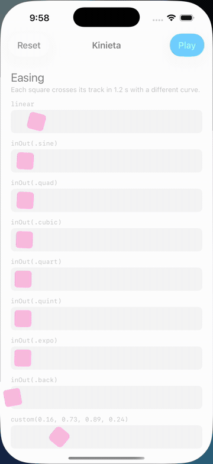

<p align="center">
  
</p>

# Kinieta

A timeline animation engine for UIKit with a typed, chainable API.

- **Timelines.** Animations run one after another, side by side, or grouped across views with a single completion.
- **Typed properties.** `.x(250)`, `.background(.systemPink)`, `.rotation(degrees: 30)`. Wrong types are compile errors. Anything else through a key path, `.custom(\.layer.shadowOpacity, to: 0.4)`, or an Auto Layout constraint, `.constant(of: leading, to: 120)`.
- **Real easing.** Cubic Bézier curves with the same semantics as CSS and cubic-bezier.com, plus presets from sine to back.
- **Perceptual colour.** Colours interpolate through LCH by default, so pink to cyan never passes through grey.
- **Handles.** Every timeline can be cancelled, paused, resumed or awaited.
- **Swift 6, iOS, tvOS and Mac Catalyst 17+, visionOS 1+.** Main-actor isolated, Sendable where it matters, Reduce Motion aware.

```swift
square.animate(.x(374), .background(.systemPink), duration: 1.0)
      .easeInOut(.back)
      .wait(1.0)
      .animate(.x(74), duration: 0.5)
      .onComplete { print("back home") }
```

<p align="center">
  
</p>

## Installation

### Swift Package Manager

In Xcode choose File, then Add Package Dependencies, and enter:

```
https://github.com/mmick66/kinieta
```

Or in `Package.swift`:

```swift
.package(url: "https://github.com/mmick66/kinieta", from: "1.0.0")
```

### CocoaPods

1.1.0 is the final CocoaPods release: CocoaPods trunk becomes read-only in December 2026. Until 1.1.0 is published there, trunk has 1.0.0, which lacks the privacy manifest and the experimental macOS support. Prefer Swift Package Manager.

```ruby
pod 'Kinieta', '~> 1.0'
```

## Usage

### Animating

`animate` sets properties over a duration. Omit the duration to set them on the next frame.

```swift
view.animate(.x(250), .y(500))                      // next frame
view.animate(.x(250), .y(500), duration: 0.5)       // half a second
view.animate(.frame(target), .alpha(0), duration: 0.3)
```

| Property | Value | Animates |
| --- | --- | --- |
| `.x`, `.y` | `CGFloat` in points | position of the top-left corner |
| `.width`, `.height` | `CGFloat` in points | size, keeping the top-left corner fixed |
| `.frame` | `CGRect` | position and size together, as the frame before any rotation |
| `.alpha` | `0...1` | `alpha` |
| `.rotation(degrees:)` | degrees | `transform`, keeping its scale and translation |
| `.background` | `UIColor` | `backgroundColor` |
| `.borderColor` | `UIColor` | `layer.borderColor` |
| `.borderWidth` | `CGFloat` in points | `layer.borderWidth` |
| `.cornerRadius` | `CGFloat` in points | `layer.cornerRadius` |
| `.custom(keyPath, to:)` | any `Interpolatable` | the view's key path; see [Custom properties](#custom-properties) |
| `.custom(\.transform, to:)` | `CGAffineTransform` | `transform` as a whole, decomposed into translation, rotation, scale and shear |
| `.constant(of: constraint, to:)` | `CGFloat` in points | an `NSLayoutConstraint`'s `constant`, laying out its views each frame |

Position and size, `.frame` included, are interpolated through `center` and `bounds`, so they stay correct while a rotation is applied: on a rotated view `.frame` sets the rect it would occupy unrotated, not UIKit's bounding-box `frame`. Rotation is not wrapped: after `.rotation(degrees: 720)`, animating to `810` turns a quarter, and going from `270` to `360` turns 90°, not 450°. Sizes, border width and corner radius never go below zero, even with an overshooting curve.

**Auto Layout.** `.x`, `.y`, `.width`, `.height` and `.frame` set geometry directly, so a view positioned by constraints snaps back on the next layout pass, which device rotation, size class changes and the keyboard all trigger. For a constrained view, animate the constraint instead:

```swift
badge.animate(.constant(of: badgeLeading, to: 120), duration: 0.5).easeOut(.back)
```

Each frame sets the constant and calls `layoutIfNeeded()` on the nearest common superview of the constraint's views (the view's superview for a width or height constraint), so the view moves with its constraints and stays where the animation leaves it. The constraint is held weakly; if it is gone when the animation starts, the property is skipped.

### Custom properties

`.custom` animates any writable key path of the view to a value of the same type:

```swift
view.animate(.custom(\.layer.shadowOpacity, to: 0.4), .custom(\.layer.shadowOffset, to: CGSize(width: 0, height: 8)), duration: 0.3)
label.animate(.custom(\UILabel.textColor, to: .systemPink), duration: 0.5)   // a subclass: name the root type
button.animate(.custom(\.tintColor, to: .systemGreen), duration: 0.5)
```

The starting value is read when the animation starts, like every property. Colours animate exactly like `.background`: through `Engine.shared.colorInterpolation`, resolved against the view's own traits, with the target assigned as given. An optional key path whose current value is `nil` fades a colour in from clear and switches any other value on the first frame. A key path rooted in a subclass, such as `\UILabel.textColor`, does nothing on a view of another class and logs a warning. Listing the same key path twice in one animation keeps the last value, like the built-in properties. `.custom` and `.constant` are main-actor functions, like `animate`.

The value must conform to `Interpolatable`. `CGFloat`, `Double`, `Float`, `CGPoint`, `CGSize`, `CGRect`, `CGAffineTransform`, `UIColor` and `CGColor` do; conform your own types with one method:

```swift
extension CGVector: Interpolatable {
    public func interpolated(to target: CGVector, progress: CGFloat) -> CGVector {
        CGVector(
            dx: dx.interpolated(to: target.dx, progress: progress),
            dy: dy.interpolated(to: target.dy, progress: progress))
    }
}
```

Progress runs from 0 to 1, and past either end under an overshooting easing such as `back`.

A `CGColor`, such as `\.layer.shadowColor`, animates like a `UIColor`, through the engine's colour interpolation.

A `CGAffineTransform` is not blended entry by entry, which would shrink a view halfway through a quarter turn. Like Core Animation, Kinieta splits each end into a translation, a rotation, a scale on each axis and a shear, interpolates those and puts them back together:

```swift
view.animate(.custom(\.transform, to: CGAffineTransform(scaleX: 1.5, y: 1.5).rotated(by: .pi / 4)), duration: 0.4)
view.animate(.custom(\.transform, to: .identity), duration: 0.4)
```

The rotation takes the shorter way round, since a transform cannot tell a half turn from one and a half; for more, or to spin past 180°, use `.rotation(degrees:)`. A flip such as `CGAffineTransform(scaleX: -1, y: 1)` scales through zero instead of turning. `.custom(\.transform)` and `.rotation` both write the transform, so a newer one of either takes it over from an older one still running (see [Interrupting](#interrupting)).

Custom key paths count as fades for [Reduce Motion](#reduce-motion) and keep animating, except a `CGAffineTransform`, which counts as motion and snaps. Pass `isMotion: true` for any other one that moves, resizes, rotates or scales something, so it snaps too: `.custom(\.bounds, to: target, isMotion: true)`; `isMotion: false` keeps a transform animating.

### Easing

Pass an easing with the animation it shapes. The default is linear.

```swift
view.animate(.x(250), duration: 0.5, easing: .in())       // quad
view.animate(.x(250), duration: 0.5, easing: .out(.cubic))
view.animate(.x(250), duration: 0.5, easing: .inOut(.back))
```

The chain calls `easeIn`, `easeOut`, `easeInOut` and `easing(_:)` apply an easing to the previous animation instead, and replace one passed as a parameter:

```swift
view.animate(.x(250), duration: 0.5).easeInOut(.back)
view.animate(.x(250), duration: 0.5).easing(.inOut(.expo))
```

Curves: `.sine`, `.quad`, `.cubic`, `.quart`, `.quint`, `.expo` and `.back`. For your own curve pass a `Bezier` to `Easing.custom`; it takes the two inner control points in the order [cubic-bezier.com](https://cubic-bezier.com/#.16,.73,.89,.24) lists them, and is used as given:

```swift
let snap = Bezier(0.16, 0.73, 0.89, 0.24)
view.animate(.x(250), duration: 1.0, easing: .custom(snap))
```

Each curve is baked into a lookup table when it is made and solved at time `x`, exactly like CSS `cubic-bezier()`: `snap.progress(at: 0.3)` is the eased progress 30% of the way through the duration. The presets are baked once and shared, so easing costs no allocation; make a custom `Bezier` once and reuse it. Curves such as `back` overshoot on purpose.

### Sequencing

Chained calls run one after another. An animation's `delay:` postpones its start; `wait` inserts a pause; `repeat` appends copies of the whole chain, including the actions already running or done.

```swift
view.animate(.x(250), .y(500), duration: 0.5, easing: .inOut(.cubic))
    .wait(0.5)
    .animate(.x(300), .y(200), duration: 0.5, easing: .inOut(.cubic))
    .animate(.x(0), .y(0), duration: 0.5, delay: 0.2)
    .repeat(times: 1)
```

`animate(_:duration:delay:easing:)` takes its parameters in the order of UIKit's `animate(withDuration:delay:options:)`: the duration, the delay, then how to animate. It builds the same step as the chain calls `animate(_:duration:)`, `easing(_:)` and `delay(_:)`, which still work: `delay(_:)` postpones the previous action, including a `wait` or a `Kinieta.group`, and adds to a delay passed as a parameter, as a second `delay(_:)` does.

`repeatForever()` replays the whole chain the same way, over and over until you cancel the handle: a spinner, a pulsing badge, a breathing placeholder. The loop is a single step that replays one copy of the chain, so it costs the same however long it runs.

```swift
let pulse = badge.animate(.alpha(0.3), duration: 0.8, easing: .inOut(.sine))
    .animate(.alpha(1), duration: 0.8, easing: .inOut(.sine))
    .repeatForever()

pulse.cancel()  // stops it where it is
```

A looping timeline never finishes: `finished()` returns once it is cancelled or its view is deallocated, and a `Kinieta.group` that runs it never calls its completion. Completion blocks inside the chain run on every cycle. Nothing can follow the loop, so a chain call made after `repeatForever()` does nothing and, in debug builds, logs a warning. A cycle that takes no time, such as one of zero durations or one that snaps under Reduce Motion, plays once per frame rather than hanging the app. Pausing, cancelling, grouping and interrupting work as on any other timeline; each cycle starts its animations anew, so it takes back a property that a newer animation took over during the previous one. `repeat(times:)` makes its copies at once and stops at 10,000 of them, with a warning; use `repeatForever()` to loop for good.

Durations and delays are in seconds. A negative or NaN one is treated as zero and logs a warning, so it never skips ahead or stalls the timeline. `wait(.infinity)`, `delay(.infinity)` and `animate(_:duration:delay:)` with `delay: .infinity` hold the timeline until you cancel it; an infinite `animate` duration is treated as zero.

### Parallel actions

`parallel()` gathers everything added since the last `then()` or `parallel()` and runs it together.

```swift
view.animate(.x(200), duration: 1.0, easing: .inOut(.cubic))
    .animate(.alpha(0), duration: 0.2, delay: 0.8, easing: .out())
    .parallel()
    .onComplete { print("moved and faded") }
```

Use `then()` to seal a step before starting a parallel block:

```swift
view.animate(.x(300), duration: 1.0)      // first, on its own
    .then()
    .animate(.x(200), duration: 1.0)      // then these two
    .animate(.alpha(0), duration: 0.2)    // together
    .parallel()
```

### Composing steps

The chain builds a timeline call by call, and some calls edit the one before: `easing`, `delay` and `onComplete` reach back to the previous action, and `parallel()` gathers everything since the last `then()`. A `Step` is a whole timeline, or any part of one, written as a single value instead. `run` plays it:

```swift
card.run {
    Step.animate(.alpha(1), duration: 0.3)
    Step.parallel {
        Step.animate(.y(40), duration: 0.5, easing: .out(.back))
        Step.animate(.background(.systemTeal), duration: 0.5)
            .delay(0.1)
    }
    Step.wait(1)
    Step.animate(.alpha(0), duration: 0.3)
        .onComplete { card.removeFromSuperview() }
}
```

| Step | Does |
| --- | --- |
| `Step.animate(_:duration:delay:easing:)` | animates properties, like `view.animate` |
| `Step.wait(_:)` | waits |
| `Step.call(_:)` | calls a block, taking no time |
| `Step.sequence { … }` | runs its steps one after another |
| `Step.parallel { … }` | runs its steps together, ending when the last one does |

Every step takes the modifiers `.delay(_:)`, `.onComplete(_:)`, `.repeat(times:)` and `.repeatForever()`, each of which returns a new step. Easing has no modifier: it is the `easing:` parameter of `Step.animate`, the only step it applies to. `view.run { … }` runs its steps in sequence, `view.run(step)` runs one step, and `handle.run(step)` appends a step to an existing timeline, as `animate` does.

Write `Step.` on every line. Inside the braces, a line that starts with a dot continues the expression on the line before it, so `.animate(…)` would be read as a call on the previous step, not as a new one. That rule is also what lets a modifier such as `.onComplete` sit on its own line under its step.

A step's animations have no view until it runs: `run` gives them the view it is called on. So one step can run on many views, each animating on its own, and `if`, `switch` and `for` work inside the braces:

```swift
let rise = Step.animate(.y(0), .alpha(1), duration: 0.4, easing: .out(.cubic))

for (index, cell) in cells.enumerated() {
    cell.run(rise.delay(Double(index) * 0.05))
}

badge.run {
    if isNew {
        Step.animate(.rotation(degrees: 15), duration: 0.1)
        Step.animate(.rotation(degrees: 0), duration: 0.1)
    }
    Step.animate(.alpha(1), duration: 0.2)
}
```

Steps build the same timeline as the chain and play it identically, frame for frame: the chain is the shorthand for a short run of steps on one view. One difference: a step's `.repeat(times:)` keeps one copy of the step with a count instead of copying it, so it has no limit. As with the chain, it plays the step once and then `times` more times. A step's `.onComplete` always adds a block, while a second chained `onComplete` replaces the first. Timelines run with `run` are ordinary handles: pause, cancel, group and await them as below, and a timeline is cancelled when its view is deallocated.

### Grouping views

`Kinieta.group` runs several timelines together and calls its completion once, when the last one finishes. It returns a handle for the whole group.

```swift
let slide = card.animate(.x(374), duration: 1.0).easeInOut(.cubic)
let spin  = badge.animate(.rotation(degrees: 360), .alpha(0), duration: 1.2)

Kinieta.group(slide, spin) { print("both finished") }
```

The group is the first step of the handle's own timeline, so the handle chains like any other: `delay` postpones the whole group, `wait` and `onComplete` follow it, and `repeat` or `repeatForever()` replays it.

```swift
Kinieta.group(slide, spin)
    .delay(0.5)
    .onComplete { print("both finished") }
    .wait(1.0)
    .onComplete { print("a second later") }
```

The group handle has no view of its own, so `animate` on it does nothing and, in debug builds, logs a warning; animate the grouped timelines instead.

The group handle controls its members: `cancel()` cancels every timeline in the group (their `finished()` calls return), and `pause()` and `resume()` pause and resume them all. A member can still be cancelled or paused on its own, but cannot resume while its group is paused. If you let go of a paused group handle, its members leave the group, still paused: resume or cancel each on its own handle. If you let go of a running group handle, the group keeps driving its members; if it is waiting forever, as after `delay(.infinity)`, they wait with it until each is cancelled on its own handle.

A timeline belongs to at most one group. `Kinieta.group` leaves out, with a logged warning, any timeline that is already in a group or has already finished or been cancelled; a timeline listed twice runs once. A member extended after it finished rejoins its group if the group is still running, and otherwise runs on its own.

### Controlling a timeline

Every call returns a `Kinieta` handle.

```swift
let handle = view.animate(.x(250), duration: 2.0)

handle.pause()
handle.resume()
handle.cancel()          // stops where it is; no further completions run
handle.state             // .running, .paused, .finished or .cancelled

await handle.finished()  // suspends until the timeline finishes or is cancelled
```

`cancel()` and `pause()` take effect immediately, even from inside an `onComplete` block, at any depth of `then()`, `delay`, `parallel` or `Kinieta.group`: the next action does not start in that frame, the other members of a group are not advanced, and a cancelled timeline stays `.cancelled` and runs no further completion blocks, including the group's.

A handle can be extended at any time, not only while chaining. Actions added to a running timeline play after the ones already there; actions added to a finished timeline start it again on the next frame, and `finished()` waits for them. `Kinieta(for: view)` gives an empty handle to build later. Easing, `delay`, `onComplete`, `then()` and `parallel()` only reach actions that have not started yet (debug builds warn when one finds nothing to act on; see [Troubleshooting](#troubleshooting)), and a cancelled timeline ignores further calls. A finished timeline forgets its actions, so a later `repeat` copies only what was added since.

Handles hold their view weakly and never keep it alive. When the view is deallocated the timeline is cancelled before anything else in it runs, even while it is paused or waiting on `wait(.infinity)`: no further completion blocks are called, the handle ends `.cancelled` and `finished()` returns.

### Interrupting

A newer animation of a property takes it over from an older one still running on the same view, as UIKit does with `beginFromCurrentState`. The newer animation starts from the value on screen, and the older one stops writing that property but keeps animating the rest:

```swift
view.animate(.x(300), .alpha(0), duration: 2.0)
// A second later:
view.animate(.x(0), duration: 0.5)   // x turns back from about 150; alpha keeps fading to 0
```

Nothing has to be cancelled. The older animation keeps its duration, so its completion block runs when the properties it kept finish, or at its scheduled end if all were taken, and the rest of its timeline stays on schedule. A later step of that timeline takes the property back when it starts, so cancel the older handle if you are replacing the whole timeline.

`.frame` counts as `.x`, `.y`, `.width` and `.height`, so a newer `.x` takes only the position from an older `.frame`, and a newer `.frame` takes all four from older animations. A `.custom` key path is matched by the key path itself, except that any key path to the view's `transform`, such as `\.transform` or `\UIImageView.transform`, counts as `.rotation`, which writes it too. A `.constant` is matched by its constraint, whichever view's timeline animates it.

### Colour

Colours interpolate through the perceptual CIE LCH space by default, with hue taking the shorter arc. Choose per property or change the engine default. The endpoints are assigned exactly as given, so a dynamic colour such as `.systemBackground` keeps adapting to Dark Mode after the animation, and a Display P3 colour keeps its gamut. The frames in between resolve dynamic colours against the view's own traits, and follow them if the appearance changes mid-animation. The frames in between are clipped to sRGB only when both endpoints are in sRGB; between Display P3 colours they stay in Display P3, so a wide-gamut animation keeps its saturation on the way instead of jumping to it on the last frame. Fading to or from `.clear` fades alpha instead of passing through black.

```swift
view.animate(.background(.systemBlue, interpolation: .rgb), duration: 1.0)
Engine.shared.colorInterpolation = .hsb   // .rgb, .hsb or .lch
```

### Reduce Motion

When the user has Reduce Motion on, movement snaps and fades stay, as Apple's Human Interface Guidelines recommend: position, size and rotation (`.x`, `.y`, `.width`, `.height`, `.frame`, `.rotation`), constraint constants (`.constant`), `CGAffineTransform` key paths such as `\.transform` and key paths marked `isMotion: true` jump to their end state, while `.alpha`, `.background`, `.borderColor`, `.borderWidth`, `.cornerRadius` and other `.custom` key paths still animate over the full duration. An animation with only movement in it finishes on its first frame. Completion blocks still run, and pauses keep their duration so sequence timing is preserved.

```swift
Engine.shared.reduceMotionBehavior = .snapAll        // snap every property, as 1.0 did
Engine.shared.respectsReduceMotion = false           // ignore Reduce Motion entirely
```

The setting is read as each animation starts. The example app shows whether Reduce Motion is on and lets you switch between the two behaviours.

### Frame rate

The engine advances by real elapsed time, so it stays on schedule through dropped frames and on 60 Hz and 120 Hz displays alike. By default it asks for 120 Hz on ProMotion devices and lets the system drop as low as 30 Hz to save power or under thermal pressure; iPhones only go above 60 Hz when the app's Info.plist sets `CADisableMinimumFrameDurationOnPhone` to `YES`.

On visionOS the default is 30–100 Hz preferring 90. Apple Vision Pro runs at 90 Hz and switches to 96 or 100 Hz to match video; the 100 Hz ceiling keeps animations at the full display rate in those modes instead of dropping to half of it.

Change the range with `Engine.shared.preferredFrameRateRange`. It applies from the next frame, even mid-animation, and only affects smoothness and power, never how long an animation takes. Invalid ranges are ignored with a warning.

```swift
Engine.shared.preferredFrameRateRange = CAFrameRateRange(minimum: 30, maximum: 60, preferred: 60)  // slow fades: save battery
Engine.shared.preferredFrameRateRange = .default                                                 // let the system decide
Engine.shared.preferredFrameRateRange = Engine.defaultFrameRateRange                             // back to the default
```

The example app has a 60 Hz / 120 Hz toggle in its navigation bar to compare the two while the gallery plays.

The display link only runs while something can move. When every timeline is paused, or waiting on `wait(.infinity)`, the engine stops it; `resume()`, `cancel()` or a new animation starts it again. A paused or waiting timeline whose handle you let go of can never move again, so the engine releases it, with its completion blocks, once nothing is animating. A completion block that captures its own handle keeps both alive: capture it `weak`, or cancel the handle when you are done with it.

### Platforms

| Platform | Minimum | CI |
| --- | --- | --- |
| iOS | 17 | Tests, including snapshots, on the iPhone 17 Pro / iOS 26.5 simulator |
| Mac Catalyst | 17 | Tests, except the iOS-only snapshot suite |
| tvOS | 17 | Build for the tvOS Simulator |
| visionOS | 1 | Tests, except the iOS-only snapshot suite, on the Apple Vision Pro / visionOS 26.5 simulator |
| macOS (AppKit), experimental | 14 | `swift test` on the Mac host, and a build of the AppKit example app |

#### macOS (experimental)

On native macOS, Kinieta animates `NSView` with the same timeline API and the same properties.

```swift
let square = NSView(frame: NSRect(x: 20, y: 20, width: 80, height: 80))
square.wantsLayer = true
square.animate(.x(300), .alpha(0.5), .background(.systemTeal), duration: 0.6)
    .easeInOut()
    .then()
    .animate(.y(200), .rotation(degrees: 90), duration: 0.4)
```

Geometry is in the superview's coordinates: from the bottom left unless the superview is flipped. `.x`, `.y`, `.width`, `.height` and `.frame` set the view's frame, and resizing keeps the origin where it is. `.rotation` sets `frameRotation` but turns the view about its centre, like `frameCenterRotation`, and reads back unwrapped, as on UIKit; positive angles turn counterclockwise unless the superview is flipped. Once a view is rotated, its `frame.origin` is the corner AppKit pivots on, so `.x`, `.y` and `.frame` stand for the frame the view would have unrotated, centred where it is: position, size and rotation animate independently, as they do on UIKit. `.alpha` sets `alphaValue`. `.borderWidth` and `.cornerRadius` set the layer's `borderWidth` and `cornerRadius`, and `.background` and `.borderColor` take an `NSColor` and set the layer's `backgroundColor` and `borderColor`; each gives a view without a layer one. The colours interpolate as on UIKit, sRGB and Display P3 alike. A dynamic colour, such as `.labelColor`, resolves against the view's `effectiveAppearance`, and again if that changes mid-animation; since a layer holds a `CGColor`, the colour it ends on is the variant for the appearance at that moment, and does not follow a later change. `NSColor` and `CGColor` conform to `Interpolatable`. `.custom` takes key paths rooted in `NSView` or a subclass, such as `\.layer!.shadowOpacity` on a layer-backed view or `\NSBox.fillColor`, and interpolates `NSColor` and `CGColor` values like `.background`; a key path to `frameRotation` or `frameCenterRotation` writes what `.rotation` writes, so each takes the other over, and counts as motion. `.constant` animates a constraint's constant and calls `layoutSubtreeIfNeeded()` on the nearest common superview of its items every frame. Frames come from the display link of the screen showing the window of the latest view to animate, else the main screen's, and move with that window to another screen; with no screen at all, as in a headless session, a timer drives them, so animations and their completion blocks still finish. Reduce Motion follows the Mac's accessibility setting.

On other platforms, such as Linux, the sources compile away and the package builds as an empty module, which keeps tooling happy but is not a supported target. CI checks this on Linux (Swift 6.3): `swift build` succeeds and `swift test` runs 0 tests. Depending on Kinieta does not pull in swift-snapshot-testing or its swift-syntax dependency; SwiftPM resolves only dependencies of the products you use, and snapshot testing is used by the test target alone.

## Troubleshooting

### A chain call does nothing

Some chain calls have nothing to act on and are ignored. In debug builds each one logs a warning with the file and line of the call, under the subsystem `Kinieta`, category `Chain`, so it shows in Xcode's console and in Console.app:

```
easing(_:) follows a wait, not an animation; ignoring it (MyApp/CardView.swift:42)
```

| Call | Ignored when | Fix |
| --- | --- | --- |
| `easing`, `easeIn`, `easeOut`, `easeInOut` | the previous step is not an animation: a `wait`, `parallel()`, `then()` or `Kinieta.group` | pass it as the `easing:` parameter of the `animate` it shapes, or chain it straight after that `animate`; inside a `parallel()` block, ease each animation before `parallel()` |
| `delay`, `onComplete`, easing | the timeline is empty, or every action in it has already started | chain it straight after the action, before the next frame |
| `parallel()`, `then()` | nothing was added since the last `then()` or `parallel()`, the timeline is empty, or everything has started | drop the extra call |
| `repeat(times:)` | `times` is zero or negative, or the timeline is empty | pass 1 or more; a finished timeline forgets its actions, so repeat before it ends |
| `repeatForever()` | the timeline is empty | chain it after the actions to loop, before the timeline ends |
| any call | it follows `repeatForever()`, which never ends | put the call before `repeatForever()`, or start a new handle |
| `animate` | the handle is a `Kinieta.group` handle, which has no view | animate the grouped timelines |
| `run(_:)` | the handle is a `Kinieta.group` handle and the step animates | run the step on each view, or on the grouped timelines' handles |

Release builds neither check nor log these calls. A cancelled timeline ignores every call without a warning.

Invalid durations and frame rate ranges, and timelines left out of a `Kinieta.group`, are logged in every build, under the categories `Timeline` and `Engine`.

### Name clashes

The module and its main class are both named `Kinieta`, so `Kinieta.Property` names a member of the class, not of the module. If your module has its own `Property`, `Easing`, `Engine` or `Step`, which shadow Kinieta's, reach Kinieta's through the class, which nests each of them under the same name:

```swift
struct Property { /* yours */ }

let fadeOut: Kinieta.Property = .alpha(0)
let done: Kinieta.Completion = { print("faded") }
view.animate(fadeOut, duration: 0.3).easing(Kinieta.Easing.inOut(.cubic)).onComplete(done)
```

`Kinieta.Completion` is the type of completion blocks, `@MainActor () -> Void`. It replaces the top-level `Block`, which is deprecated.

### Building an XCFramework

With `BUILD_LIBRARY_FOR_DISTRIBUTION=YES` the emitted `Kinieta.swiftinterface` fails to verify: it qualifies types as `Kinieta.Property`, and there `Kinieta` resolves to the class. Pass `-alias-module-names-in-module-interface` so the interface names the module by an alias. CI builds this way:

```
xcodebuild -scheme Kinieta -destination 'generic/platform=iOS Simulator' BUILD_LIBRARY_FOR_DISTRIBUTION=YES OTHER_SWIFT_FLAGS=-alias-module-names-in-module-interface build
```

## Example app

`Example/KinietaDemo.xcodeproj` is a gallery: every easing preset on its own track, the three colour spaces side by side, a composed timeline with a grouped completion, a Steps row that runs one `Step` value on four squares with a staggered delay, a Controls section that pauses, resumes and cancels one handle and reports when `await finished()` returns, an Interrupting row whose Left and Right buttons take a square's position over mid-flight while its colour change carries on, and an Auto Layout row whose square is centred by a constraint and swings by animating its constant. It lays out within the safe area and replays at the new size when the device rotates, since Kinieta sets frames that Auto Layout does not update; the Auto Layout row instead keeps playing through the rotation. Pressing Play while the gallery runs starts it again from where the views are. Launch it with the `-autoplay` argument to start playing on launch.

The `KinietaDemoMac` scheme is the same gallery for native macOS, animating `NSView`s: the easing, colour, timeline, Steps, Controls, Interrupting and Auto Layout rows. The window keeps a fixed width, since the targets are computed from the track widths when Play is pressed. It also takes `-autoplay`.

## Development

Tests run on the pinned simulator runtime: **iPhone 17 Pro, iOS 26.5** (Xcode 26.6). CI uses the same destination, since the snapshot references are only valid for the runtime they were recorded on.

```
xcodebuild -scheme Kinieta -destination 'platform=iOS Simulator,name=iPhone 17 Pro,OS=26.5' test
xcodebuild -project Example/KinietaDemo.xcodeproj -scheme KinietaDemo -destination 'platform=iOS Simulator,name=iPhone 17 Pro,OS=26.5' CODE_SIGNING_ALLOWED=NO build
xcrun swift-format lint --strict --recursive Sources Tests Example
```

`scripts/ci-local.sh` runs the CI jobs locally (the three above plus Mac Catalyst, the library-evolution build from "Building an XCFramework", `swift build`/`swift test` on macOS and in a Linux container via Docker, and a build of the macOS example app) and stops at the first failure. The tvOS build, the visionOS tests and an optional `pod lib lint` of the podspec run in CI only. Pass check names to run a subset, e.g. `scripts/ci-local.sh lint ios`.

Visual regression is covered by snapshot tests: each property is rendered at five progress points, the colour paths at their midpoint between sRGB and between Display P3 colours, and dynamic colours in light and dark appearance. Reference images live in `Tests/KinietaTests/__Snapshots__`. After an intentional visual change, re-record them on the pinned iPhone 17 Pro / iOS 26.5 simulator and review the PNGs before committing:

```
TEST_RUNNER_SNAPSHOT_TESTING_RECORD=all xcodebuild -scheme Kinieta -destination 'platform=iOS Simulator,name=iPhone 17 Pro,OS=26.5' test
```

`swift test` on a Mac runs only the macOS (AppKit) tests, and on Linux none; use the `xcodebuild` commands above for the rest. Requires Xcode 26. Documentation is a DocC catalog in `Sources/Kinieta/Kinieta.docc`, including a guide for migrating from 0.5; build it for UIKit and for AppKit, and neither should warn:

```
xcodebuild docbuild -scheme Kinieta -destination 'generic/platform=iOS Simulator'
xcodebuild docbuild -scheme Kinieta -destination 'platform=macOS'
```

Per-frame cost benchmarks (`Tests/KinietaTests/Benchmarks.swift`) time 1,000 views animating four properties, a 10,000-step timeline, 500 nested timelines, `Bezier.progress(at:)` and LCH colour interpolation, and print the best of 10 runs in nanoseconds per frame, step or call. Timings depend on the machine, so they are not a pass/fail test: they run only with `KINIETA_BENCH=1`, and normal test runs and CI skip them. `scripts/bench.sh` sets it and runs them in release mode, on the Mac (`NSView`) by default or on the pinned iOS Simulator (`UIView`) with `scripts/bench.sh ios`. Compare a change by running it before and after on the same idle machine.

## License

MIT. See [LICENSE](LICENSE).
